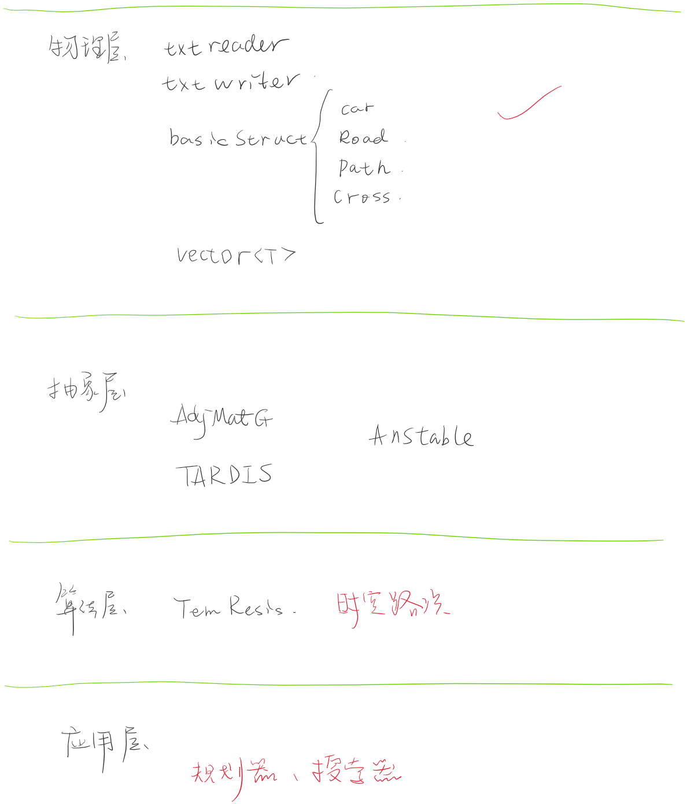
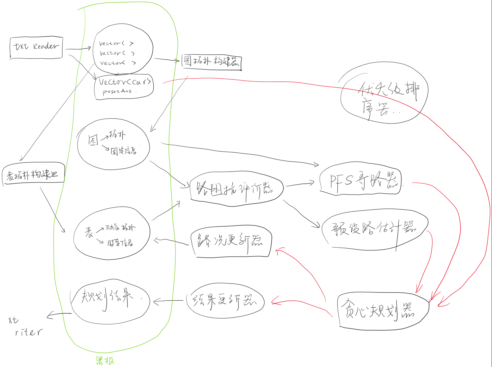
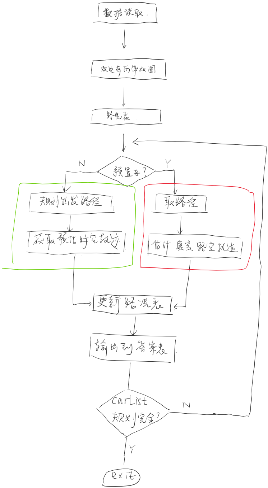
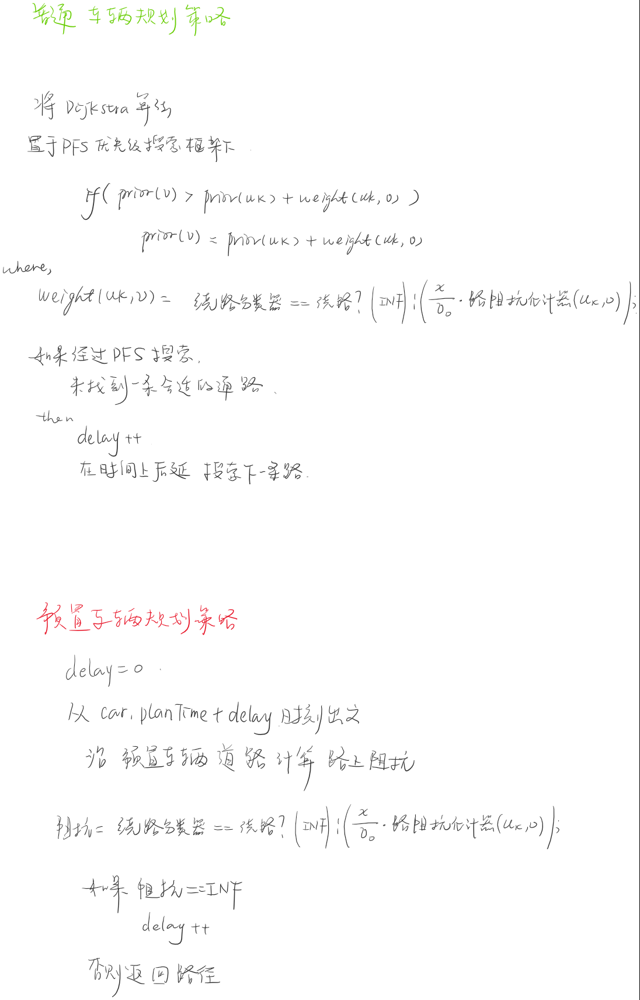
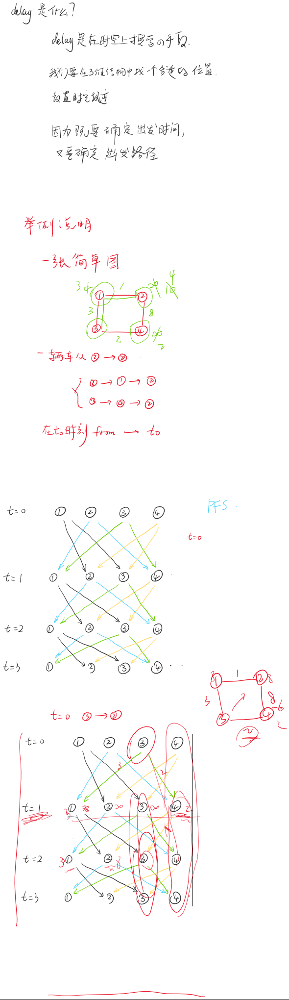

# codecraft 2019

给俺也整一个 (李超贤 曾祁泽)

初赛西北第九

复赛西北19

复赛中打出gg

如果有启发 各位看官大佬点个star～

# 思路

数据结构的实现很大程度参考了 邓俊辉老师的 数据结构(C++ 第三版) 感谢

我们的解决方案没有判题器 因为一开始觉得调参不靠谱 要纯靠模型 然而后来还是真香了 也死在调参太慢上

其实基本模型就是考虑了前车影响的最短路径

预防死锁就是靠玄学调参

首先介绍一下模型的数据结构

我们认为路况信息有两种：

一种是静态的，一种是时变的

静态的存入图 时变的存入表

先上图

## 初赛模型

我们把问题重述为在2D平面图上规划一条路径，并且每一辆车贪心规划费用最小的问题。

同时引入一个时空的规划表，规划表记录着之前已规划好的路径。

求解的方法就是Dijkstra，但是将其纳入PFS框架下，并与规划表结合。

PFS在遍历的过程中 是否走某一条路 取决于这条路本身的性质和路况

如果某一条路太过于拥堵 直接认为该路断路

对于每一辆车 从from节点开始遍历一遍图

这样PFS按照权重在 双边带权的有向图上 每一次遍历都得到一条最小支撑树 （的子树，因为某个节点有可能因为拥堵断路）

这条最小支撑树以车的 from为根，其它节点为子节点

因为边的权就是我们估计的车的速度 因此节点的权重 就是根节点到达这里的时间

如果能够逆向地 从车的to 找到一条到from的通路 那就说明 车能够从当前时间出发

否则delay一段时间 推迟发车

我们就把规划出的这一条 时空的轨迹 更新在规划表上

我们不找最优解，对每一辆车贪心地规划出一条路径

发车按照planTime排序 这样前车的规划就会影响后车

## 复赛

改变需求后，我们之前的模型还是太小了

我们准备了一个更大的箩筐来装<del>出题人</del>新需求。

把问题看作 在箩筐中 放置软木条的问题

三维时空就是 箩筐 优先、预置、普通车的轨迹 就是硬度、粗细、大小不一样的木条

这样就又成了一个背包问题

通过一些放置次序的策略 ：  预置车 > 优先车 + 普通车 

为了防止死锁 木条应该放置的足够均匀 彼此之间不应该有压叠

我们做了一些假设来简化模型：
    1. 如果 一条路径的时空子路死锁、那么这条路也死锁
    2. 如果 一辆车在当前时空子路上死锁、其他车也会在当前时空的这一子路死锁 （可能是不合理的 慢车死锁 快车也会死锁吗 不知道 是个概率问题）
   
   假设1的作用是 将一段路径是否死锁的评价 交给了 一段路径的评价 于是降低复杂度
    如果一条路径上 有一个路段死锁 这条路也是死锁的 于是我们不需要评价一条路是否好 只需要评价路的一段是否好就可以了
    而我们如何评价一条路会不会死锁呢？我们训练一个分类器就可以了
        初赛中的分类器有两个维 ： 路径时间阻抗系数 和 路径容量
        我们可以用更多的知识 把各种特征输进来 然后将问题用EM/弱监督/卡尔曼来估计绕路器参数 （然而并没有实现）

   假设2其实是 单纯是为了减少搜索的次数 让delay次数减少 求解速度变快

btw，

复赛现场改的重新规划一部分预置车

最长+planTime晚排序 选前10% 效果变好了一点点

# 模型DSA

## 双边带权的有向图

读入road.txt和cross.txt后

首先构造真实cross id和图的连续id的映射表 (std::map<int,int>实现)

以及road id的类似映射

这样路网被抽象出来

在此基础上实现优先级遍历(PFS)

这样后面的所有图搜索策略都在PFS基础上实现

一旦图被构建以后，就没有动态操作了

所以用邻接表和邻接矩阵一起分别实现的节点查找、边查找

## 优先级遍历

PFS是BFS DFS的抽象，BFS DFS Dijkstra等图算法都是PFS的特例

在使用PFS估计从 uk到v边的权重 weight(uk,v) != weight(v,uk)

例如5000 边的 1-2方向路段和2-1方向除非道路都是空的，否则权重就是不同的 weight(1,2) != weight(2,1) 

我们赋予weight(uk,v)的意义是 从uk 到v的通行时间t

 $t = t_0\times R$

其中，

$$
t_0 = \frac{Length}{min\{ V_{car}, V_{road}\}}
$$

$$
R = 1 + 0.15 \times (N_{car}/volum)^{4}
$$

$$
volum = channel \times Length
$$

$N_{car}$由规划表记录 是uk-v道路上 在此时此刻的车辆数目

当描述道路拥堵程度的 R 或者 N_{car}/volum 的值不合适的时候，认为该路段断路 时间返回INF

btw，

通行时间借鉴了BPR方程 后期因为没有好的参数 后期放弃了这个模型 并且一直在失去理智的猜和试

其实这一部分应该用**机器学习+判题器**实现 这也是我没能实现的（但是有人做了类似的）

t的回归应该交给一个回归器去做

是否判断拥堵返回INF也应该交给分类器（决策树就很合适）

需要做的就是引入更多的知识，用判题器在线下训练出一个泛化的模型，这样无论是何种地图都能够应对了

当然，这样并不能绝对地避免死锁，因为模型本身估计t就是概率的

##　规划表

规划表就是一个普通的table 线性表 存储的就是某时间、某from-to路段 有多少车占用 

规划表读的值就是$N_{car}$ 

规划表在每一次路径规划后根据轨迹的时间更新

横坐标是道路from-to数对，纵坐标是时间[0,T]

比如： 5000路是双向的 对应路口是 1-2 那就有两个数对 1-2和2-1 分别对应两个方向

如果一共有100条路 99条都是双边的 那TABLE的宽度就是 2x100 - 1x1 == 199

## 时空图

这是个没有实现的想法，拍脑袋想的，结果找到了相关博士论文 哈哈

最初是为了解决delay，但是应为没有一个好的t估计器作罢了

想法就是 这个问题如果放到时空图的结构下思考 能够减少delay

物理上相邻连接的节点，在时空上并不是相邻连接的

一张2D的城市交通图，加上时间轴就变成了一个3维的有向图

一个节点a在不同时间片上就有 t0-a t1-a t2-a 很多状态

在2D图上从节点a-b被5000路相连 但在时空上

从t0时刻的a 到b需要一定的时空开销

t0的a是和 t1的b相连的

其中t1-t0就是通过5000的时间

这样所有的时空轨迹 就能够最终组成一个三维的有向图

对OD对进行分配路径的时候，就成了一个背包问题

一个车的路段规划 就是一次在三维有向图上搜索最小费放置地点的问题

当某路段在某时刻出现拥堵的时候，这条路段被从三维图中设为断路

这样，随着搜索次数增加，搜索的空间是会越来越小的 这样就某种程度上利用动态规划减少了delay

